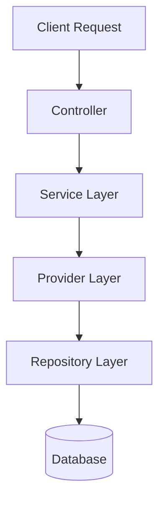
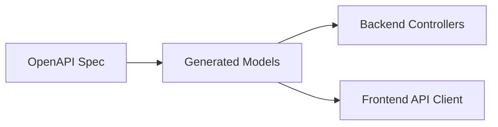
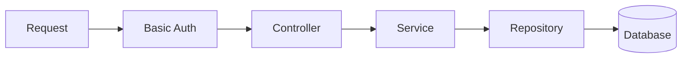
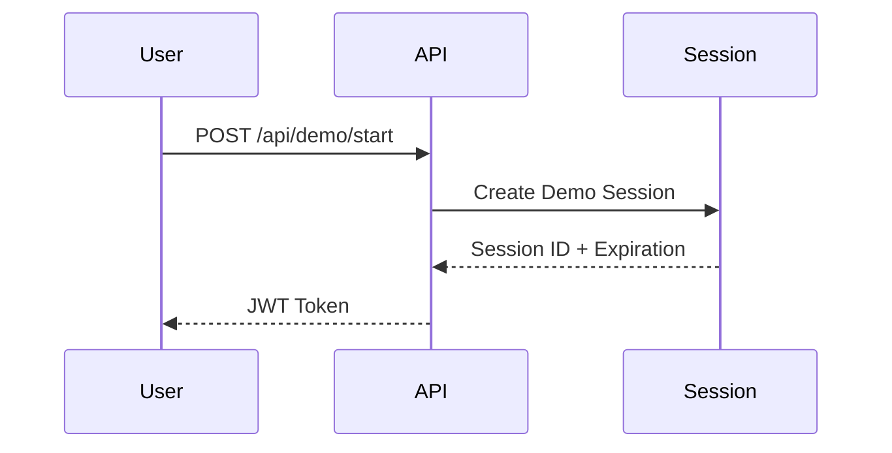
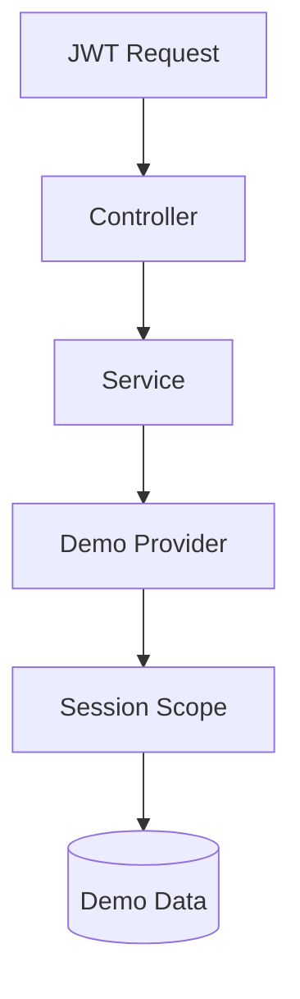
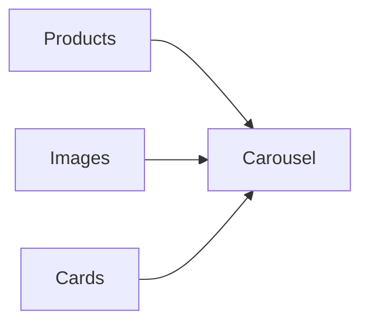

# FlowerShopApi

A full-stack commerce platform built to demonstrate modern backend architecture, API-first development, automated testing, and deployment workflows.

The project combines a Spring Boot backend with a Preact frontend into a single deployable unit. It showcases production-oriented patterns such as layered architecture, OpenAPI code generation, JWT authentication, environment-specific data providers, scheduled cleanup jobs, integration testing, Dockerized deployment, and CI/CD automation.

---

## Purpose

Most portfolio projects focus on either frontend design or backend CRUD operations.

FlowerShopApi was built to demonstrate how a larger application can be structured using patterns commonly found in professional environments:

* Layered architecture
* API-first development
* Authentication and authorization
* Environment-specific behavior
* Automated testing
* CI/CD pipelines
* Containerized deployment
* Monorepo organization

The application provides a complete flower shop management system while serving as a showcase of full-stack engineering practices.

---

# Architecture

The application follows a traditional layered architecture.



Each layer has a dedicated responsibility:

| Layer      | Responsibility                   |
| ---------- | -------------------------------- |
| Controller | HTTP request handling            |
| Service    | Business logic                   |
| Provider   | Environment-specific data access |
| Repository | Database communication           |
| Database   | Persistent storage               |

---

# Monorepo Structure

The project uses a Gradle multi-module setup.

```text
root
├── server
├── frontend
├── openapi
├── tests
└── deployment
```

Although multiple modules exist, the backend server acts as the primary build target.

During the build process:

1. OpenAPI documentation is generated.
2. Frontend assets are compiled.
3. Generated frontend files are copied into Spring static resources.
4. A single deployable application is produced.

This allows Spring Boot to serve:

* REST API
* OpenAPI documentation
* Frontend application

from a single deployment artifact.

---

# OpenAPI-Driven Development

The backend contract is defined through OpenAPI specifications.

Generated artifacts provide:

* API documentation
* Request/response models
* Type-safe interfaces
* Frontend integration support

This reduces duplication and keeps frontend/backend communication synchronized.



---

# Runtime Profiles

The application supports two distinct runtime modes.

## Production Mode

Production mode represents a standard business application.

Authentication is performed using Basic Authentication.



All entities are stored directly within the primary database schema.

---

## Demo Mode

Demo mode was developed to allow visitors to safely explore the application without affecting production data.

A dedicated session lifecycle is introduced.

### Session Initialization



---

### Demo Data Flow



Instead of querying repositories directly, the provider layer resolves data through the active demo session.

This creates isolated environments for each visitor while reusing the same business logic.

Example:

```java
// Demo Mode
provider.getAll()
 -> session
 -> flowers
 -> mapped entities

// Production Mode
provider.getAll()
 -> repository.findAll()
```

The provider abstraction allows the service layer to remain unchanged regardless of environment.

---

# Security

The project demonstrates multiple authentication approaches.

## Production

* Basic Authentication
* Role-based access control
* Protected endpoints

## Demo

* JWT Authentication
* Session-scoped data
* Automatic expiration

---

# Session Cleanup

Demo sessions are temporary.

A scheduled cleanup job periodically removes expired sessions and their associated data.


This prevents database growth from abandoned demo environments.

---

# Frontend

The frontend is built using Preact and Vite.

Special attention was given to experimentation in UI/UX design.

## Features

* Animated interfaces
* Emoji particle interactions
* Dynamic transitions
* Reusable universal carousel component
* Responsive layouts

### Universal Carousel

The carousel component was intentionally designed to be content-agnostic.



The component can render arbitrary content while maintaining a consistent interaction model.

---

## Testing Strategy

The testing approach focuses on validating core backend behavior, API contracts, and security rules while maintaining fast execution and avoiding unnecessary duplication of logic verification.

---

### 1. Unit Tests (Service Layer)

Unit tests validate business logic in isolation.

- Dependencies are mocked using Mockito
- No Spring Boot context is loaded
- No database interaction occurs

These tests focus on:
- Entity ↔ model mapping
- Service-level logic and transformations
- Edge cases and exception handling

---

### 2. Controller Integration Tests (MockMvc)

Controller tests validate the HTTP layer and security configuration.

- Uses `MockMvc` to simulate HTTP requests
- Spring context is loaded
- Repository layer is mocked to isolate API behavior

These tests focus on:
- Endpoint availability and routing
- Request/response structure
- Validation rules (e.g. invalid payloads → `400 Bad Request`)
- Security enforcement (e.g. HTTP Basic authentication)

These tests intentionally do not validate persistence logic, as repositories are mocked to isolate API behavior.

---

### 3. Demo Mode Testing Strategy

The application includes a dedicated Demo Mode that shares the same service and business logic as Production Mode.

Because both modes execute identical service-layer logic, **retesting business logic separately in Demo Mode is unnecessary**.

Instead, Demo Mode testing focuses on:

- Session creation and lifecycle (`/api/demo/start`)
- JWT authentication flow
- Scope isolation (session-bound data access)
- Provider-based data resolution behavior
- Cleanup job correctness (session expiration handling)

This ensures that Demo Mode is validated at the **boundary and scope level**, while avoiding redundant duplication of service-layer tests.

---

### Summary

- Unit tests validate business logic in isolation
- Controller tests validate API behavior and security rules
- Demo Mode tests validate **authentication, session scope, and access isolation**
- Business logic is shared across modes and therefore tested once at the service layer
---

# CI/CD & Deployment

The project includes:

* Docker support
* GitHub Actions workflows
* Automated builds
* Automated testing
* Deployment to Render

Database support:

| Environment | Database   |
| ----------- | ---------- |
| Local       | MySQL      |
| Cloud       | PostgreSQL |

The persistence layer was designed to remain database-agnostic through Spring Data abstractions.

---

# Tech Stack

## Backend

* Java
* Spring Boot
* Spring Security
* Gradle
* OpenAPI Generator

## Frontend

* Preact
* Vite

## Database

* MySQL
* PostgreSQL

## DevOps

* Docker
* GitHub Actions
* Render

## Testing

* JUnit
* Spring Test
* Integration Testing
* Mockito

---

# Future Improvements

* Refresh token support
* Fine-grained role permissions
* Observability dashboards
* Metrics collection
* Audit logging
* Kubernetes deployment
* Event-driven order processing

---

This project demonstrates backend architecture, API design, authentication, testing practices, deployment automation, and modern frontend engineering within a single full-stack application.
